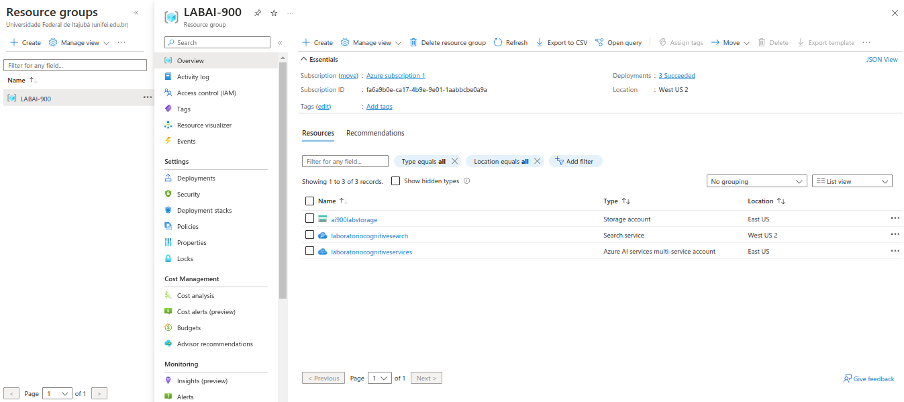
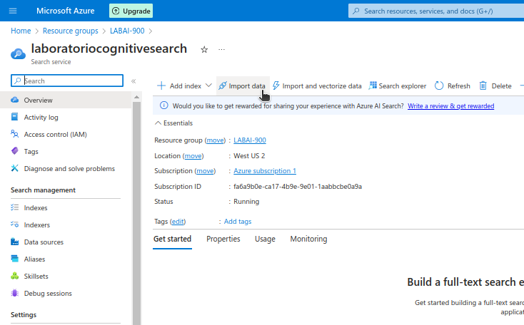
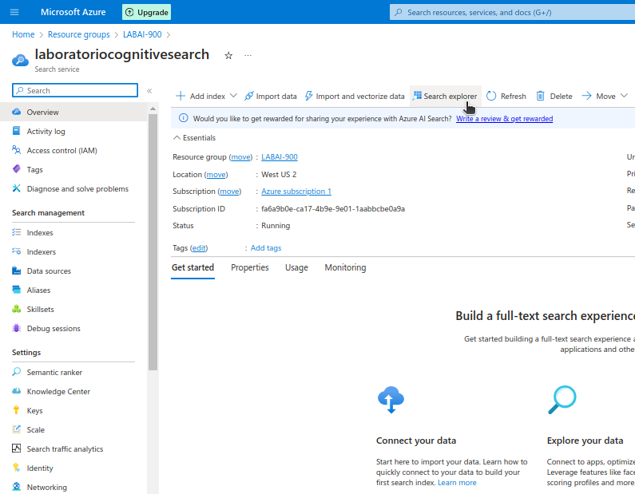
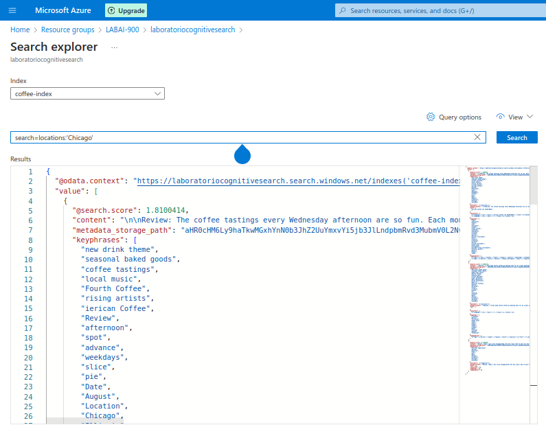
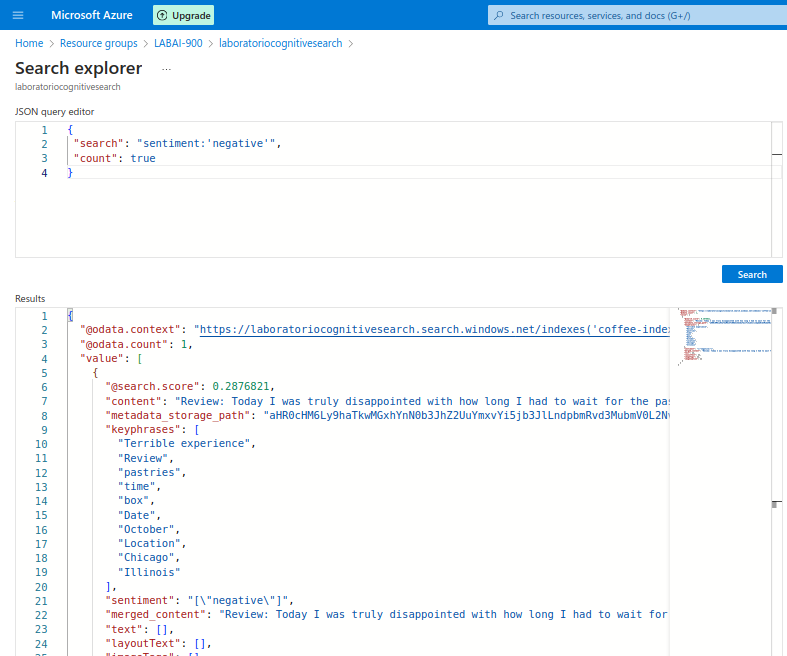

# Azure Cognitive Search: Utilizando AI Search para indexação e consulta de Dados**  

-blue)  
  
  
  
  
  

## **📌 Introdução**  

A quantidade massiva de dados disponíveis atualmente exige ferramentas avançadas para análise e extração de informações. O **Azure Cognitive Search** permite indexar, pesquisar e enriquecer documentos, tornando-os mais acessíveis e organizados.  

Este projeto faz parte do **Bootcamp Microsoft Azure AI Fundamentals**, promovido pela **DIO**, e explora técnicas de **Document Intelligence** para análise de avaliações de clientes de uma cafeteria fictícia.  

As principais técnicas utilizadas incluem:  

✅ **Indexação** – Torna os conteúdos pesquisáveis de forma eficiente.  
✅ **OCR (Optical Character Recognition)** – Reconhece textos em imagens e documentos digitalizados.  
✅ **Extração de frases-chave** – Automatiza a obtenção de insights.  
✅ **Análise de sentimentos** – Classifica avaliações e opiniões de consumidores.  

## **⚙️ Configuração e Procedimento**  

Para realizar a indexação e busca inteligente dos documentos, utilizamos três serviços essenciais da **Azure**:  

- **Azure AI Search** → Responsável pela indexação e pesquisa dos documentos.  
- **Azure AI Services** → Fornece recursos de inteligência artificial para enriquecer os dados.  
- **Storage Account** → Armazena os documentos em *blob containers*.  

### **1️⃣ Passo a Passo para Configuração**  

#### 🔹 Criando os recursos no Azure  

1️⃣ Acesse o portal **[Azure](https://portal.azure.com/)** e crie um **Azure AI Search**.  
2️⃣ Configure um **Storage Account** para armazenar os documentos.  
3️⃣ Habilite o **Azure AI Services** para processar e enriquecer os dados.  

#### 🔹 Fazendo o upload dos dados  

4️⃣ Carregue os arquivos no **Blob Storage**.  
5️⃣ Configure o **Azure AI Search** para acessar os documentos.  

#### 🔹 Criando o Index  

6️⃣ Utilize o assistente de importação para configurar a **indexação automática**.  
7️⃣ Escolha as *skills* de inteligência artificial para extração de insights (OCR, frases-chave, análise de sentimentos).  
8️⃣ Finalize a configuração e **inicie o processo de indexação**.  

#### 🔹 Realizando Consultas no Index  

9️⃣ Use o **Search Explorer** para testar buscas e visualizar os resultados em **JSON**.  
🔟 Execute consultas baseadas em **localização, análise de sentimentos e frases-chave**.  

### **📸 Imagens do Processo**  

   

  

   

  

   

  

   

  

   

  

   

  

## **🚀 Insights e Aplicações Práticas**  

O **Azure AI Search** oferece um grande potencial para diversos cenários, como:  

📌 **Empresas de e-commerce** → Busca avançada de produtos e análises de avaliações.  
📌 **Sistemas jurídicos** → Pesquisa e categorização automatizada de documentos.  
📌 **Hospitais e clínicas** → Indexação e consulta de prontuários médicos.  
📌 **Serviços financeiros** → Extração de informações relevantes em contratos e relatórios.  

A **Inteligência Documental** permite que grandes volumes de dados sejam analisados de forma rápida, estruturada e precisa, tornando a informação mais acessível e útil.  

## **📢 Conclusão**  

O uso de **Document Intelligence** com **Azure AI Search** facilita a extração e análise de informações contidas em documentos. Ferramentas como **indexação automática, análise de sentimentos e extração de frases-chave** possibilitam novas formas de processamento de dados, trazendo **insights valiosos** para empresas e organizações.  

Se precisar de mais informações, confira a documentação oficial:  
🔗 **[Microsoft Learn - Azure Cognitive Search](https://learn.microsoft.com/en-us/azure/search/)**  

---