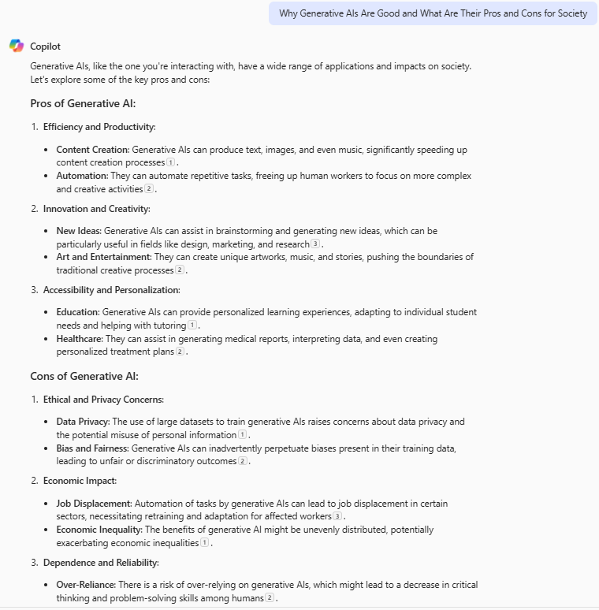
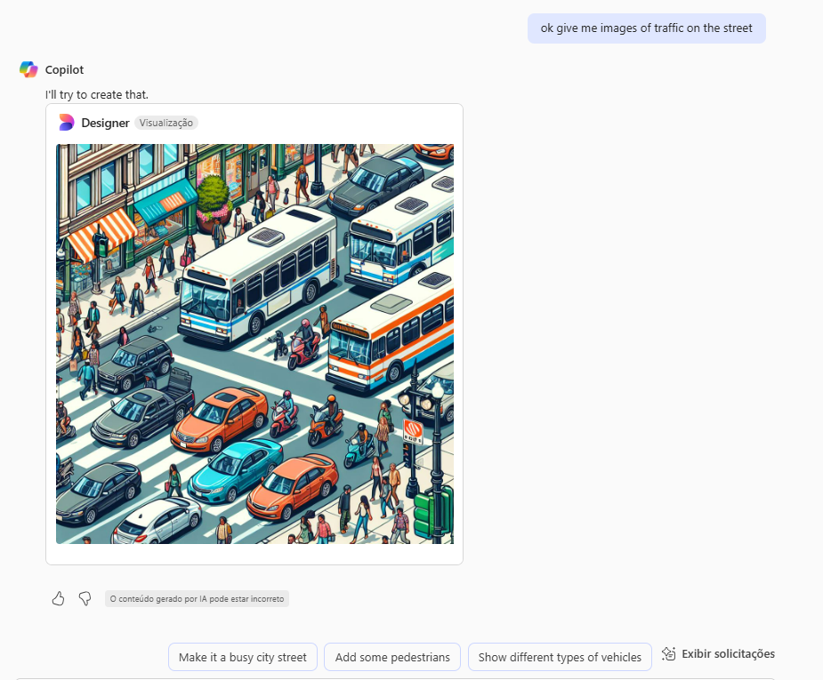
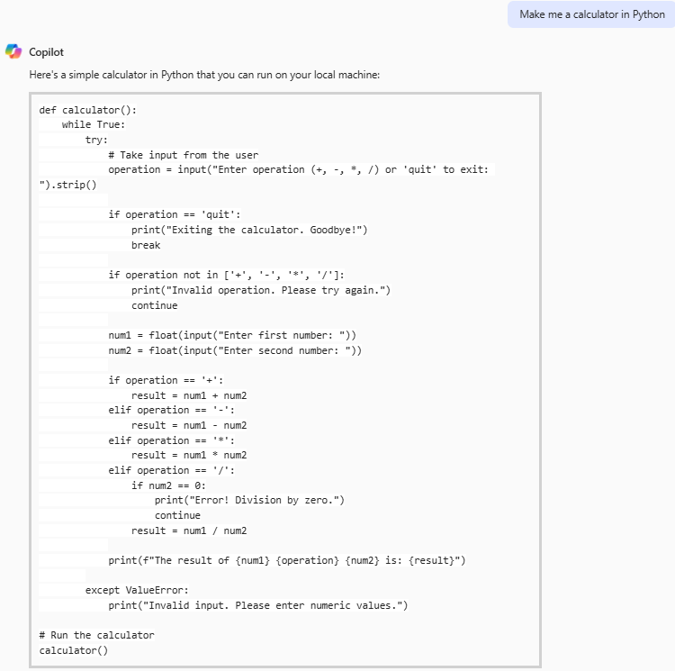

# IA Generativa com Copilot e OpenAI  

-blue)  
  
  
  

## 📌 Introdução  

Este projeto tem como objetivo testar e explorar algumas das funcionalidades do **Microsoft Copilot**, a inteligência artificial generativa da Microsoft. Os experimentos fazem parte do **Bootcamp Microsoft Azure AI Fundamentals, da DIO**.  

A **IA Generativa** está revolucionando diversas áreas, permitindo que máquinas criem conteúdo original de forma autônoma, áreas como:  

- **Arte e Design** → Criação de imagens, ilustrações e composições inovadoras.  
- **Música e Composição** → Desenvolvimento de melodias e harmonias com base em padrões musicais.  
- **Games** → Geração procedural de cenários, histórias e personagens dinâmicos.  
- **Automação e Programação** → Escrita de código com auxílio de IA, otimizando a produtividade dos desenvolvedores.  

Neste laboratório, utilizamos o **Microsoft Copilot** para gerar textos, imagens e código, explorando seu potencial na criação de conteúdos diversos.  

---

## 🛠️ Procedimento  

Para testar os recursos do **Microsoft Copilot**, siga os passos abaixo:  

1. Acesse o site oficial do **[Microsoft Copilot](https://copilot.microsoft.com)**.  
2. Faça login com uma conta Microsoft.  
3. Insira comandos (*prompts*) para gerar textos, imagens ou código.  
4. Experimente diferentes tipos de consultas para observar as respostas da IA.  

---
após isso, fiz 3 perguntas/pedidos para a IA, que foram: 

Pergunta 1:
Por que as IAs generativas são boas e quais são seus prós e contras para a sociedade?
Answer:

   

  
Pergunta 2:
Me de imagens de uma rua com transito.
Answer:

   

  
Pergunta 3:
Me faça uma calculadora em Python
Answer:

   

  